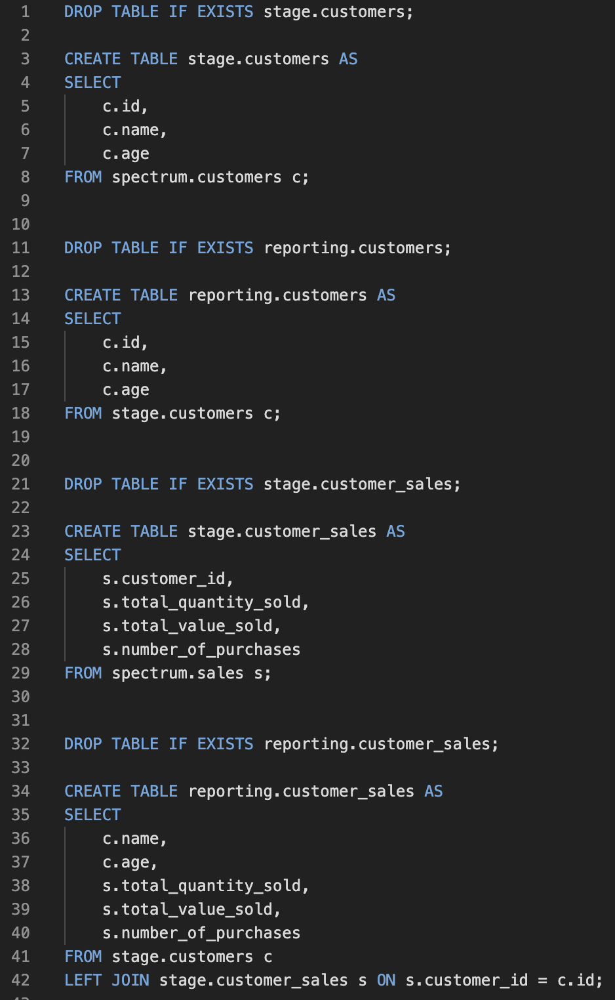
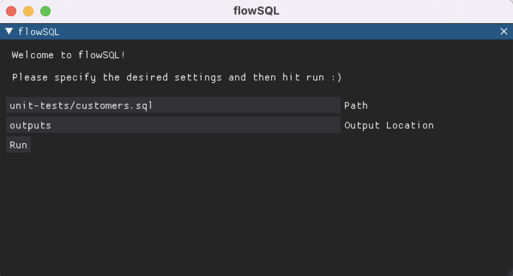
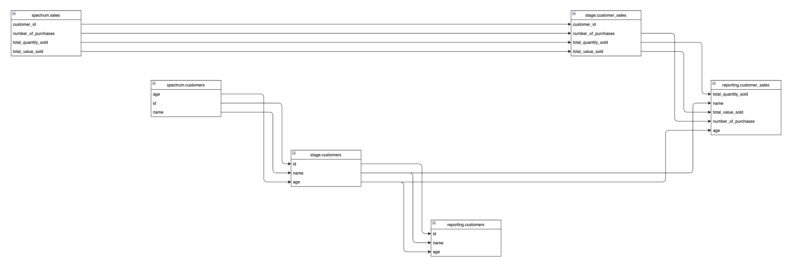

<h1 align="center">flowsql</h1>  

  

  Diagram your data pipelines.

## Table of Contents

- [Introduction](#introduction)
- [Features](#features)
- [Example](#example)
- [Feedback](#feedback)
- [Acknowledgments](#acknowledgments)

## Introduction

Documenting data pipelines is hard. Not only is it complex, but it's also time consuming. When working with big teams it becomes near impossible; documentation becomes out of date as soon as it's completed as there's continuous change. **flowsql** hopes to remedy this by allowing you to generate flow diagrams programatically. This allows for reproducable, clear diagrams, which are built with [diagrams.net](diagrams.net) so are also easily shared and edited.

## Features

A few of the things you can do with flowsql:

* Generate flow diagrams from `.sql` files

## Example

1. Starting with a standard `.sql` file, the first step would be then be to run the module on the command line:

    

    
    

    

    
    

1. After running the command a GUI window will appear. At this stage enter the path of your `.sql` file. When ready, hit the `Run` button!

    

    
    

1. The program will then analyse the SQL code and generate a [diagrams.net](diagrams.net) diagram. It will save this file in the `./output/` folder and also try and open it (although this requires a local version of `draw.io` to be installed).

    

    
    

## Feedback

Feel free to reach out on [LinkedIn](https://www.linkedin.com/in/dominic-herriott/) and please use [GitHub Issues](https://github.com/domherriott/flowsql/issues) for feature requests! :grinning:

## Acknowledgments

Thanks to all those who have contributed and helped build the packages this is built on.

Special thanks to the developers at [diagrams.net](diagrams.net)!
