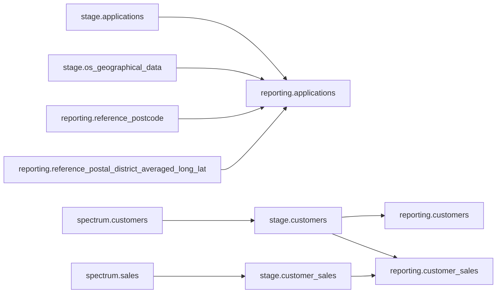

```mermaid

%%{init: {"flowchart": {"htmlLabels": false}} }%%


flowchart LR
  
    reporting.applications["reporting.applications"]
    stage.applications["stage.applications"]
    stage.os_geographical_data["stage.os_geographical_data"]
    reporting.reference_postcode["reporting.reference_postcode"]
    reporting.reference_postal_district_averaged_long_lat["reporting.reference_postal_district_averaged_long_lat"]
    stage.customers["stage.customers"]
    spectrum.customers["spectrum.customers"]
    reporting.customers["reporting.customers"]
    stage.customer_sales["stage.customer_sales"]
    spectrum.sales["spectrum.sales"]
    reporting.customer_sales["reporting.customer_sales"]
    

    stage.applications --> reporting.applications
    stage.os_geographical_data --> reporting.applications
    reporting.reference_postcode --> reporting.applications
    reporting.reference_postal_district_averaged_long_lat --> reporting.applications
    spectrum.customers --> stage.customers
    stage.customers --> reporting.customers
    spectrum.sales --> stage.customer_sales
    stage.customers --> reporting.customer_sales
    stage.customer_sales --> reporting.customer_sales
        

```