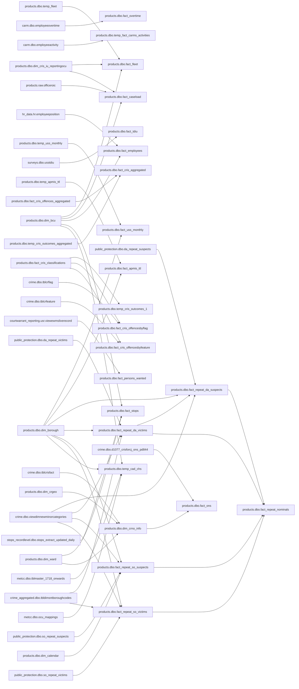

```mermaid

%%{init: {"flowchart": {"htmlLabels": false}} }%%


flowchart LR
  
    products.dbo.temp_fleet["products.dbo.temp_fleet"]
    products.dbo.dim_bcu["products.dbo.dim_bcu"]
    products.dbo.dim_cris_iu_reportingocu["products.dbo.dim_cris_iu_reportingocu"]
    products.dbo.fact_fleet["products.dbo.fact_fleet"]
    carm.dbo.employeeovertime["carm.dbo.employeeovertime"]
    products.dbo.fact_overtime["products.dbo.fact_overtime"]
    products.dbo.temp_fact_carms_activities["products.dbo.temp_fact_carms_activities"]
    carm.dbo.employeeactivity["carm.dbo.employeeactivity"]
    products.raw.officeroic["products.raw.officeroic"]
    products.dbo.fact_caseload["products.dbo.fact_caseload"]
    hr_data.hr.employeeposition["hr_data.hr.employeeposition"]
    products.dbo.fact_employees["products.dbo.fact_employees"]
    products.dbo.temp_uss_monthly["products.dbo.temp_uss_monthly"]
    products.dbo.fact_uss_monthly["products.dbo.fact_uss_monthly"]
    products.dbo.dim_borough["products.dbo.dim_borough"]
    products.dbo.fact_tdiu["products.dbo.fact_tdiu"]
    surveys.dbo.usstdiu["surveys.dbo.usstdiu"]
    products.dbo.temp_apmis_ttl["products.dbo.temp_apmis_ttl"]
    products.dbo.fact_apmis_ttl["products.dbo.fact_apmis_ttl"]
    products.dbo.fact_repeat_da_suspects["products.dbo.fact_repeat_da_suspects"]
    public_protection.dbo.da_repeat_suspects["public_protection.dbo.da_repeat_suspects"]
    crime.dbo.viewdimnewminorcategories["crime.dbo.viewdimnewminorcategories"]
    products.dbo.fact_repeat_da_victims["products.dbo.fact_repeat_da_victims"]
    public_protection.dbo.da_repeat_victims["public_protection.dbo.da_repeat_victims"]
    crime_aggregated.dbo.tbldimsntboroughcodes["crime_aggregated.dbo.tbldimsntboroughcodes"]
    products.dbo.temp_cris_outcomes_1["products.dbo.temp_cris_outcomes_1"]
    products.dbo.fact_cris_classifications["products.dbo.fact_cris_classifications"]
    products.dbo.fact_cris_aggregated["products.dbo.fact_cris_aggregated"]
    products.dbo.fact_cris_offences_aggregated["products.dbo.fact_cris_offences_aggregated"]
    products.dbo.temp_cris_outcomes_aggregated["products.dbo.temp_cris_outcomes_aggregated"]
    products.dbo.fact_repeat_so_suspects["products.dbo.fact_repeat_so_suspects"]
    public_protection.dbo.so_repeat_suspects["public_protection.dbo.so_repeat_suspects"]
    products.dbo.dim_calendar["products.dbo.dim_calendar"]
    products.dbo.fact_repeat_so_victims["products.dbo.fact_repeat_so_victims"]
    public_protection.dbo.so_repeat_victims["public_protection.dbo.so_repeat_victims"]
    products.dbo.fact_cris_offencesbyflag["products.dbo.fact_cris_offencesbyflag"]
    crime.dbo.tblcrflag["crime.dbo.tblcrflag"]
    products.dbo.fact_cris_offencesbyfeature["products.dbo.fact_cris_offencesbyfeature"]
    crime.dbo.tblcrfeature["crime.dbo.tblcrfeature"]
    products.dbo.fact_persons_wanted["products.dbo.fact_persons_wanted"]
    courtwarrant_reporting.usr.viewewmsliverecord["courtwarrant_reporting.usr.viewewmsliverecord"]
    products.dbo.fact_repeat_nominals["products.dbo.fact_repeat_nominals"]
    products.dbo.fact_ons["products.dbo.fact_ons"]
    crime.dbo.d1077_crisforcj_ons_pd844["crime.dbo.d1077_crisforcj_ons_pd844"]
    products.dbo.dim_crno_info["products.dbo.dim_crno_info"]
    stops_recordlevel.dbo.stops_extract_updated_daily["stops_recordlevel.dbo.stops_extract_updated_daily"]
    products.dbo.dim_ward["products.dbo.dim_ward"]
    products.dbo.fact_stops["products.dbo.fact_stops"]
    products.dbo.temp_cad_chs["products.dbo.temp_cad_chs"]
    metcc.dbo.tblmaster_1718_onwards["metcc.dbo.tblmaster_1718_onwards"]
    metcc.dbo.ocu_mappings["metcc.dbo.ocu_mappings"]
    crime.dbo.tblcrisfact["crime.dbo.tblcrisfact"]
    products.dbo.dim_crgeo["products.dbo.dim_crgeo"]
    

    products.dbo.temp_fleet --> products.dbo.fact_fleet
    products.dbo.dim_bcu --> products.dbo.fact_fleet
    products.dbo.dim_cris_iu_reportingocu --> products.dbo.fact_fleet
    carm.dbo.employeeovertime --> products.dbo.fact_overtime
    carm.dbo.employeeactivity --> products.dbo.temp_fact_carms_activities
    products.raw.officeroic --> products.dbo.fact_caseload
    products.dbo.dim_bcu --> products.dbo.fact_caseload
    products.dbo.dim_cris_iu_reportingocu --> products.dbo.fact_caseload
    hr_data.hr.employeeposition --> products.dbo.fact_employees
    products.dbo.dim_bcu --> products.dbo.fact_employees
    products.dbo.temp_uss_monthly --> products.dbo.fact_uss_monthly
    products.dbo.dim_borough --> products.dbo.fact_uss_monthly
    surveys.dbo.usstdiu --> products.dbo.fact_tdiu
    products.dbo.temp_apmis_ttl --> products.dbo.fact_apmis_ttl
    products.dbo.dim_borough --> products.dbo.fact_apmis_ttl
    public_protection.dbo.da_repeat_suspects --> products.dbo.fact_repeat_da_suspects
    crime.dbo.viewdimnewminorcategories --> products.dbo.fact_repeat_da_suspects
    products.dbo.dim_borough --> products.dbo.fact_repeat_da_suspects
    products.dbo.fact_repeat_da_victims --> products.dbo.fact_repeat_da_suspects
    public_protection.dbo.da_repeat_victims --> products.dbo.fact_repeat_da_victims
    crime.dbo.viewdimnewminorcategories --> products.dbo.fact_repeat_da_victims
    crime_aggregated.dbo.tbldimsntboroughcodes --> products.dbo.fact_repeat_da_victims
    products.dbo.dim_borough --> products.dbo.fact_repeat_da_victims
    products.dbo.fact_cris_classifications --> products.dbo.temp_cris_outcomes_1
    products.dbo.fact_cris_offences_aggregated --> products.dbo.fact_cris_aggregated
    products.dbo.temp_cris_outcomes_aggregated --> products.dbo.fact_cris_aggregated
    public_protection.dbo.so_repeat_suspects --> products.dbo.fact_repeat_so_suspects
    crime.dbo.viewdimnewminorcategories --> products.dbo.fact_repeat_so_suspects
    products.dbo.dim_borough --> products.dbo.fact_repeat_so_suspects
    products.dbo.dim_calendar --> products.dbo.fact_repeat_so_suspects
    public_protection.dbo.so_repeat_victims --> products.dbo.fact_repeat_so_victims
    crime.dbo.viewdimnewminorcategories --> products.dbo.fact_repeat_so_victims
    crime_aggregated.dbo.tbldimsntboroughcodes --> products.dbo.fact_repeat_so_victims
    products.dbo.dim_borough --> products.dbo.fact_repeat_so_victims
    products.dbo.fact_cris_classifications --> products.dbo.fact_cris_offencesbyflag
    crime.dbo.tblcrflag --> products.dbo.fact_cris_offencesbyflag
    products.dbo.fact_cris_classifications --> products.dbo.fact_cris_offencesbyfeature
    crime.dbo.tblcrfeature --> products.dbo.fact_cris_offencesbyfeature
    courtwarrant_reporting.usr.viewewmsliverecord --> products.dbo.fact_persons_wanted
    products.dbo.fact_repeat_da_suspects --> products.dbo.fact_repeat_nominals
    products.dbo.fact_repeat_da_victims --> products.dbo.fact_repeat_nominals
    products.dbo.fact_repeat_so_suspects --> products.dbo.fact_repeat_nominals
    products.dbo.fact_repeat_so_victims --> products.dbo.fact_repeat_nominals
    crime.dbo.d1077_crisforcj_ons_pd844 --> products.dbo.fact_ons
    products.dbo.dim_crno_info --> products.dbo.fact_ons
    stops_recordlevel.dbo.stops_extract_updated_daily --> products.dbo.fact_stops
    products.dbo.dim_ward --> products.dbo.fact_stops
    products.dbo.dim_bcu --> products.dbo.fact_stops
    metcc.dbo.tblmaster_1718_onwards --> products.dbo.temp_cad_chs
    metcc.dbo.ocu_mappings --> products.dbo.temp_cad_chs
    products.dbo.dim_borough --> products.dbo.temp_cad_chs
    products.dbo.dim_bcu --> products.dbo.temp_cad_chs
    crime.dbo.tblcrisfact --> products.dbo.dim_crno_info
    products.dbo.dim_crgeo --> products.dbo.dim_crno_info
    products.dbo.dim_ward --> products.dbo.dim_crno_info
        

```