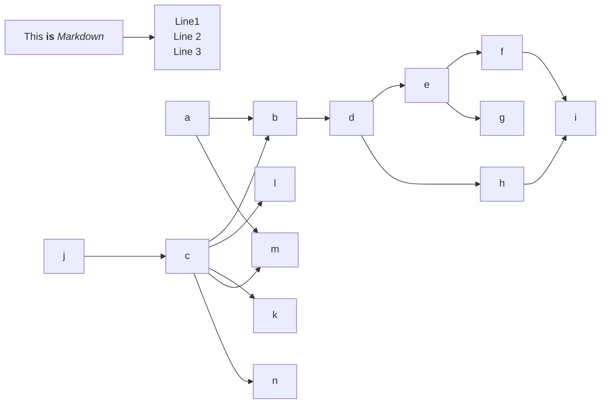

```mermaid
%%{init: {"flowchart": {"htmlLabels": false}} }%%
flowchart LR
    markdown["`This **is** _Markdown_`"]
    newLines["`Line1
    Line 2
    Line 3`"]
    a["a"]
    b["b"]
    c["c"]
    d["d"]
    e["e"]
    f["f"]
    g["g"]
    h["h"]
    j["j"]
    k["k"]
    l["l"]
    m["m"]
    n["n"]

    markdown --> newLines
    a --> b
    c --> b
    b --> d
    d --> e
    e --> f
    e --> g
    d --> h
    h --> i
    f --> i
    c --> l
    j --> c
    c --> k
    c --> m
    a --> m
    c --> n
    

```